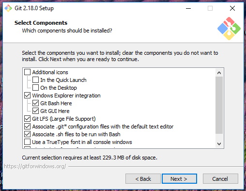
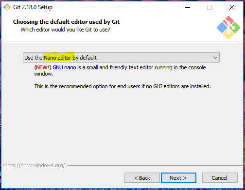
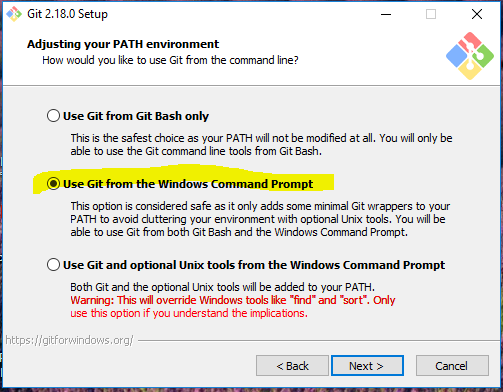
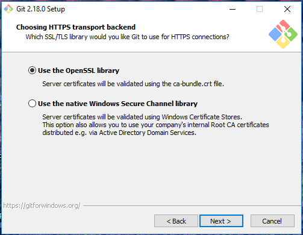
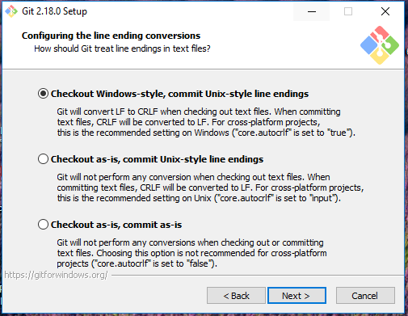
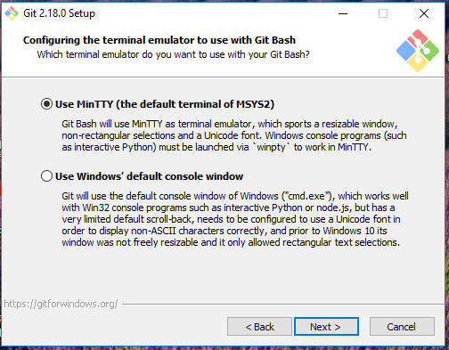
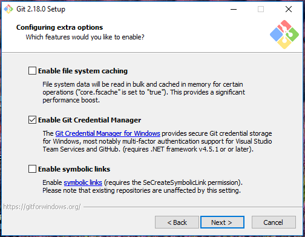
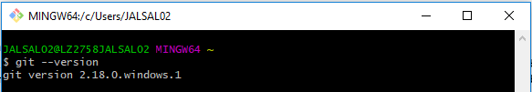

# Git Install Screenshots

## Free Software

Git is free, open-source software. As part of the workshop we are tryng to put in a group free software request form, but if you need to do your own, make sure to do it in advance! 

## Install Location

Make sure you know where Git is installed! You can have EZtech put it in teh usual place, but I would suggest a folder within your user directory, such as:

    C:\Users\USERNAME\Programs\Git\

This will allow you to update it as necessary.

## Options

During the installation process, the installer asks several questions about how you would like to set up Git for Windows. I have found the default options to work well (and I believe they can be changed later anyway) but I thought I would provide screenshots of the installation option screens that I see with a brief description.

1.	Components to install - both Git Bash and Git GUI may be useful!

2.	Editor - I mostly use RStudio, not these, but I find nano much easier than vim.

3.	Any of these will allow you to use Git from Git-Bash, but I would recommend adding Git to the PATH so you can use it from the command prompt as well.

4.	Default OpenSSL seems to work fine.

5.	Line endings. Since most EPA users are on windows, there may not be any worry, but the default option makes sure there aren't problems if you collaborate with people on Mac or Linux machines.

6.	Default works fine

7.	Credential manager. When you access your Github account, Git will ask for your username and password. The windows credential manager will cache your password so that you don't need to re-enter it every time. In addition, you can access your cached credentials later by going to Control Panel > Credential Manager > Windows Credentials > Generic Credentials

## Test your Installation

Once you have gone through the installation process, you should test to make sure it worked. Go to a command prompt or Git Bash and type `git --version`
Hopefully you see something like: 

