# Practice

This section includes exercises to practice basic Git operations you might do every day. We plan to provide time for students to go through this material during the workshop session.

- [ ] Make and clone a new repo on Github
- [ ] Edit files directly on Github
- [ ] The pull, edit, commit, push cycle
  - [ ] Using the command line
  - [ ] Using Git-GUI
  - [ ] Using RStudio / other IDE

## Make and clone a new repo on Github

The easiest way to get a new project started is with "Github first, then clone locally" sequence. There are other options, but this approach has the fewest possible hiccups.

The instructions here are copied/adapted from Jenny Bryan's [approach here](http://happygitwithr.com/new-github-first.html) with extra screenshots. If you are having trouble here, you could try the source material.

### Make a repo on Github

**Do this once per new project.**

Go to <https://github.com> and make sure you are logged in.

Click green "New repository" button. Or, if you are on your own profile page, click on "Repositories", then click the green "New" button.

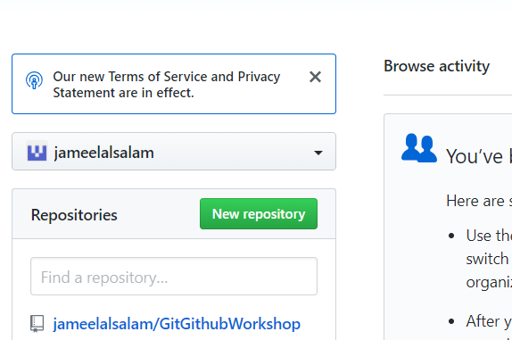

Repository name: `myrepo` (or whatever you wish)  
Public  
YES Initialize this repository with a README

Click the big green button "Create repository."

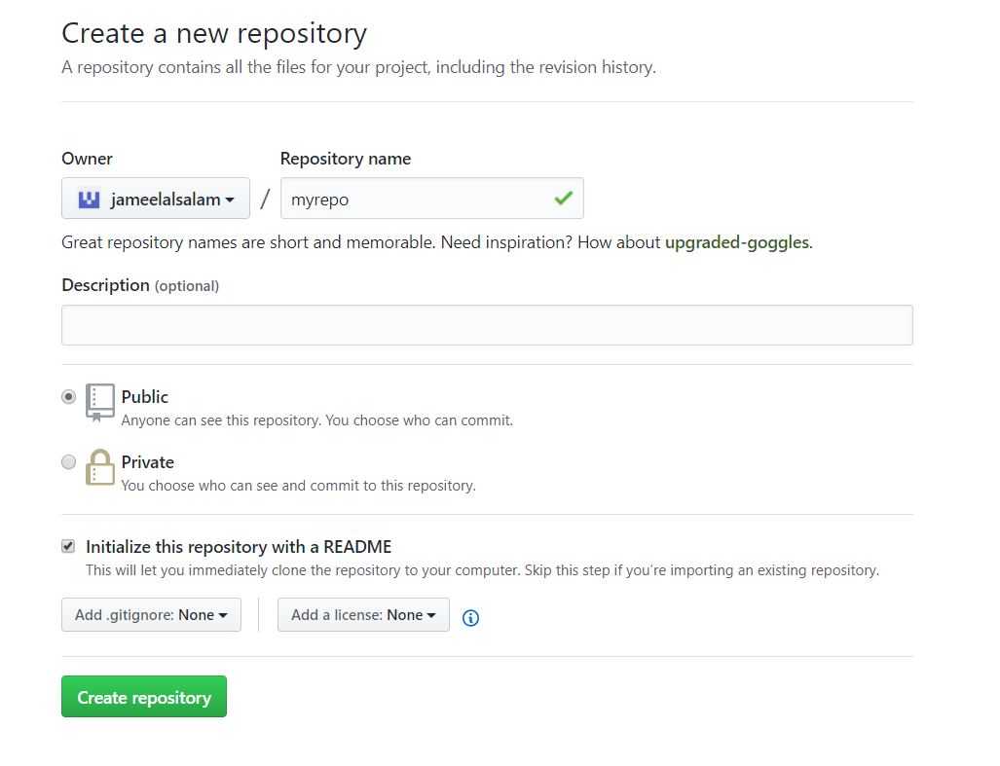

Copy the HTTPS clone URL to your clipboard via the green "Clone or Download" button. Or copy the SSH URL if you chose to set up SSH keys.

### Clone repo locally

Open Git Bash. First we need to decide where we want to put the new repo directory. I recommend creating a directory in which to store all your programming project repos. One option is to make a `repos` folder inside your `Documents` directory. The following show basic navigation:

    cd ~
    pwd
    cd Documents
    mkdir repos
    cd repos

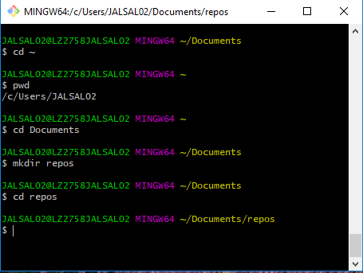

When you clone a repo from Github, it will create a new folder (with the same name as the repo) within whatever directory you are in at the time. Type `git clone` and then right-click and paste the url you previously copied from Github.

## Edit Files Directly on Github

Most of the time you will be editing files on your own computer, but for quick changes you can directly edit the files on Github.

Open the repo you just created and go to the README.md file.

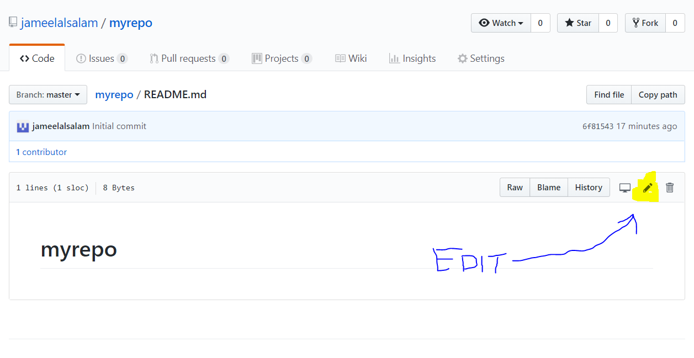

Maybe add the standard EPA disclaimer to the README.

Disclaimer
The United States Environmental Protection Agency (EPA) GitHub project code is provided on an "as is" basis and the user assumes responsibility for its use.  EPA has relinquished control of the information and no longer has responsibility to protect the integrity , confidentiality, or availability of the information. 
Any reference to specific commercial products, processes, or services by service mark, trademark, manufacturer, or otherwise, does not constitute or imply their endorsement, recommendation or favoring by EPA.  
The EPA seal and logo shall not be used in any manner to imply endorsement of any commercial product or activity by EPA or the United States Government.

When you are done, scroll down to add a commit message and commit your changes.

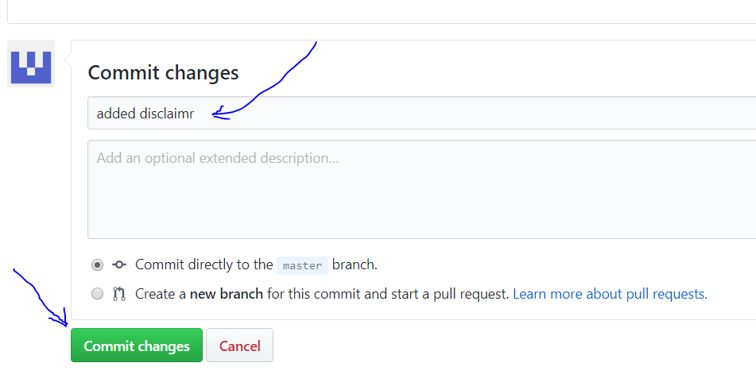

## The pull, edit, commit, push cycle

The basic series of steps you will be following day-in, day-out will be:

1) pull/fetch: get any changes from Github to your local machine
2) edit: make your changes to various files
3) commit changes using Git
4) push your changes back to Github so your collaborators can see them

We are going to go through these steps using the Bash command line, the Git-GUI, and RStudio (for the R users).

Some rules of thumb:

- Commit early, commit often. Maybe once an hour? Certainly every day.
- Pull before you commit. This avoids merge conflicts with your colleagues.
- Push after every commit. This makes your changes available to your colleagues, and again helps avoid merge conflicts.

### With Git Bash

  
Expand the steps here.

Navigate to your repo folder in Git Bash. Check status and pull.

    cd myrepo
    git fetch origin
    git status
    git pull
    git status
    
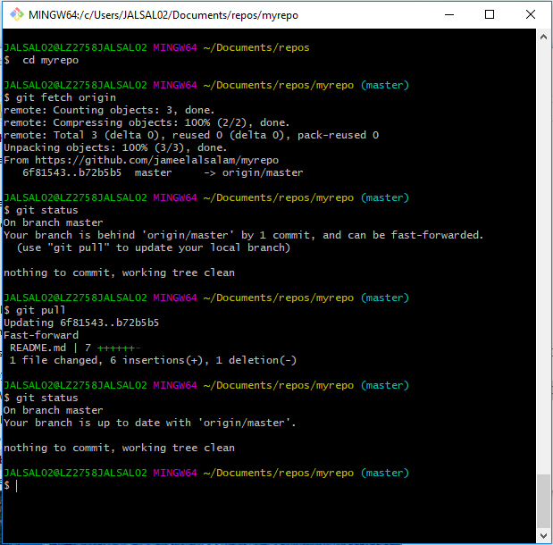

Now use your favorite text editor to make a new file. For my example, I will make `hello.R`. Make sure to save it into your local repository folder!

Once you are done, and saved your file, go back to Git Bash.

    git status
    
Notice that there is now an "untracked file". This is a new file not yet tracked by Git under version control. We are going to add the new file to the staging area, make a commit (with message) and push back to Github.
    
    git add hello.R
    git commit -m "adding hello world script"
    git status
    git push origin

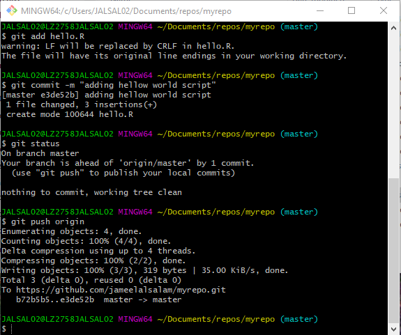

Go back to Github and refresh the page to see that your changes are on the internet.

### With Git-GUI

Expand the steps here.

Find Git-GUI in the start menu.

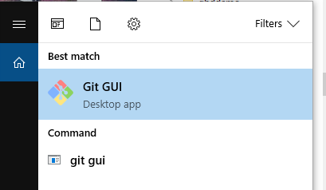

Click "Open Existing Repository" and navigate to test repo we've been using.

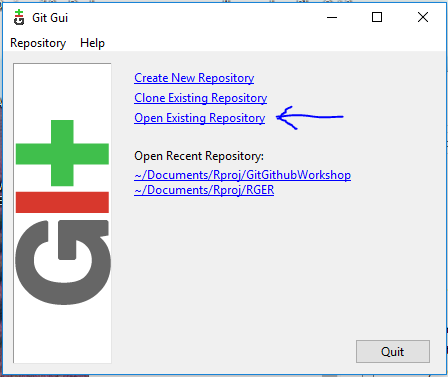

You can look at the commit history with `Repository >> Visualize master's history`

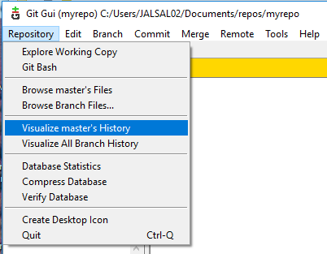

Which pops open `gitk` with information on various commits.

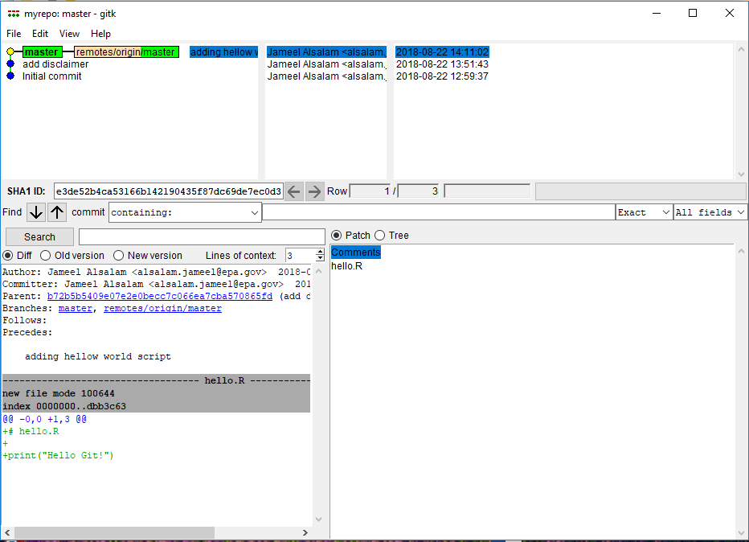

Close out the visualization window.

Open up a text editor and make some changes to a file. I modified `hello.R`

Then when you go back to Git-GUI, click the following:

* Rescan (so that Git-GUI will notice changes)
* Stage file by clicking document icon
* Type a commit message in the box
* Push

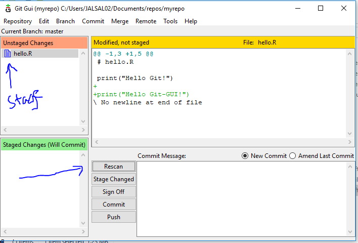

Git-GUI pops a new window, but you should be able to just click "push"

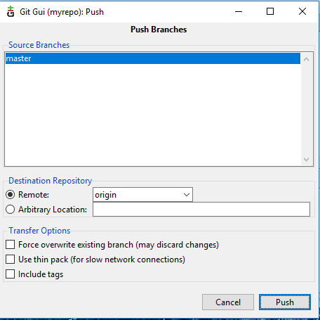

### With RStudio

Expand the steps here.

Finally, some IDE's (such as RStudio) have Git integration which allows you to commit from within the IDE. If you are an R user, this may be more convenient than the alternatives.

* Open up a new RStudio session. 
* Click `File >> New Project >> Existing Directory >> Navigate to the folder >> Create Project

When the new project is initiated, hopefully RStudio sees Git, and there will be a shiny new "Git" tab in the upper-right window.

If the Git tab doesn't appear, that either means you are not in a Git project or RStudio doesn't see Git. If the latter problem, try telling RStudio specifically where to find Git.

* `Tools >> Global Options >> Git/SVN`
* And fill in the path for the Git executable

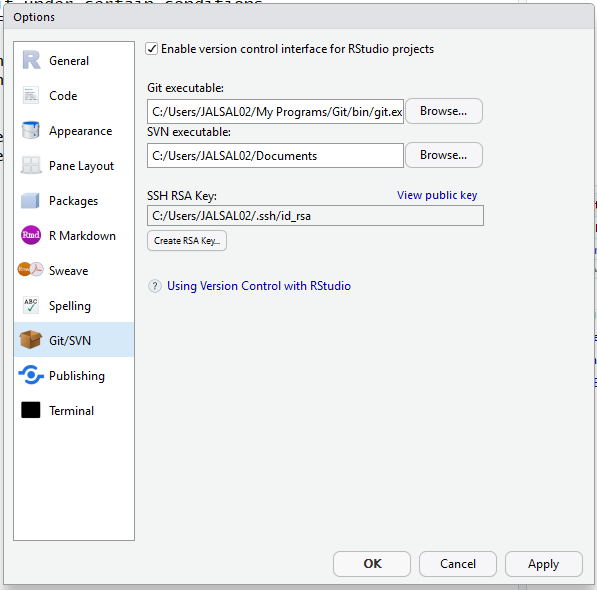

You may need to restart RStudio, but hopefully now you have the Git tab.

To go forward with the cycle click:

* Blue down arrow (pull)
* Edit files as usual
* Stage files with the little checkboxes (in my experience, RStudio is very laggy doing this)
* Commit
* Fill in commit message to finalize commit
* Green up arrow (push to Github)

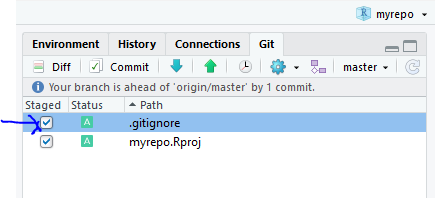

Whew! That was a lot of screenshots. But now you have some practice with the basic cycle using 3 different tools.

## Exercises:

1. Read the manual page for `git commit`. What does the `-m` mean in `git commit -m "initial commit"`? (Hint: try `git help commit` from Git Bash)
2. Is it possible to stage files to be committed using the command line, and then actually make the commit using a different tool (Git-GUI or RStudio)?
3. If an RStudio user, try using Git from teh "Terminal" pane. (`Tools >> Terminal >> New Terminal)

  
Expand bonus content here

## Bonus Content

Here we started with a repo on Github, then cloned it locally. But there are lots of different ways to do the sequencing.

## Make a local repo, put it on Github

[Jenny Bryan approach here](http://happygitwithr.com/existing-github-last.html)

You can initialize a repo either from the Git-Bash command line:

    mkdir newproject
    cd newproject
    git init
    
Or using a client, e.g., "New Version Control Project" from RStudio

Then make some new files and put them in the folder. Add and commit them with Git.

    
    nano README.md
    (Ctrl-X, and 'Y' once you are done)
    
    git add README.md
    git fetch origin
    git commit -m "initial commit"
    git push origin
    

    