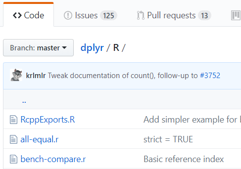
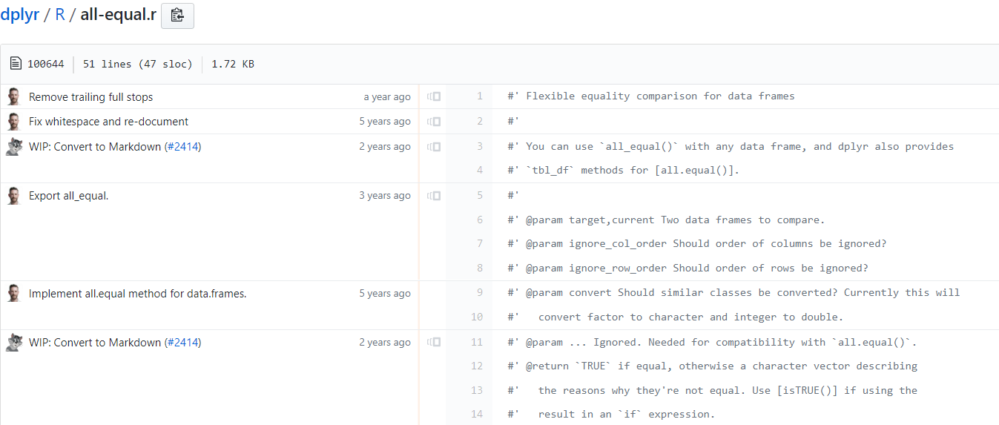
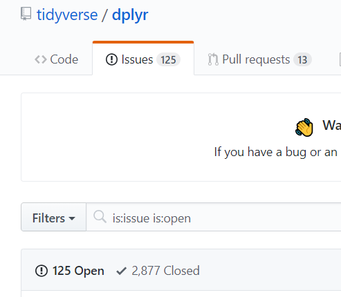
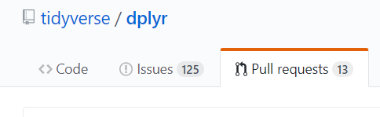

# Repo History

One benefit of version control is the ability to trace back the history of changes in your code. In this section we will try out a couple of options for exploring repository history.

- [ ] Inspect repo history on Github
- [ ] LICENSE.md, Contributor guidelines
- [ ] Inspect repo history with Git-GUI and gitk
- [ ] Git history: diffs, blames, branches

## Expore Repo History on Github

Choose an existing repo with some history. It could be [this repository](https://github.com/jameelalsalam/GitGithubWorkshop) or maybe the Github repository for a Python or R package that you have used in the past. Maybe: 

* [dplyr](https://github.com/tidyverse/dplyr) or 
* [pandas](https://github.com/pandas-dev/pandas)

The repository page has tons of information. You can explore the current code, see what bugs have been reported in the code, and what changes have been suggested by the community.

Since the README file is used as the home page for a repo on Github, this is frequently the place to go to learn about a piece of software you haven't used before.

Expand steps & screenshots for exploring history on Github

### Browsing Code

Navigate into a code folder and open up a code file.

Reading well-written code can be a great way to improve your own programming, particularly when you want your code to function like other projects that you have seen.

Github offers may different ways to explore the history of an individual code file. In the upper right should be some different views of the file you are browsing.

Explore the Raw, Blame, and History views -- what are they showing?

### Issues

Are you having trouble using a package? Maybe someone else is having a similar problem and has requested a fix. From the repository home, go to the `issues` tab.

You can search through open or closed issues, and see what discussion there has been around solutions so far.

(note: new repos won't have issues -- take a look at a widely used one. The repo for the [Atom](https://github.com/atom/atom) text editor has > 600 isssues, for example)

### Pull requests

Some open source projects attract a lot of users contributing code improvements. You can take a look at proposed changes users have suggested on Github. Open the `pull requests` tab

## Extras: LICENSE.md, CONTRIBUTING.md, codes of conduct, etc

Some questions that come up when working on open-source code are:
1) What license should I use?
2) What guidance should I provide to potential contributors to the project?
3) What about a code of conduct?

Addressing what EPA needs for all of these is beyond the scope here, but while we are browsing repos, take a look at how other projects have addressed these questions.

For example:
* dplyr's [license](https://github.com/tidyverse/dplyr/blob/master/LICENSE.md), [contributor guidelines](https://github.com/tidyverse/dplyr/blob/master/.github/CONTRIBUTING.md), [code of conduct](https://github.com/tidyverse/dplyr/blob/master/.github/CODE_OF_CONDUCT.md), and [issue template](https://github.com/tidyverse/dplyr/blob/master/.github/ISSUE_TEMPLATE.md)
* panda's [.github folder](https://github.com/pandas-dev/pandas/tree/master/.github) has many of these same items. It also has an extensive [contributing guide](https://pandas.pydata.org/pandas-docs/stable/contributing.html) linked from the README.

The main folder of a repo or the `.github` folder are common places to find these files.

## Explore Repo History with Git-GUI

### Clone an existing repo locally

### Open the Repo in Git-GUI

TODO: add screenshot from Git-GUI opening a repo

### Inspect Commit Graph

TODO: add screenshot from Git-GUI/gitk

## Git History: diffs, blames, branches

It is possible to explore diffs, blames, branches, commits, etc, all from the command line. I have to admit I don't have much experience with this, but you could try out:

TODO: find a link to recommend.

